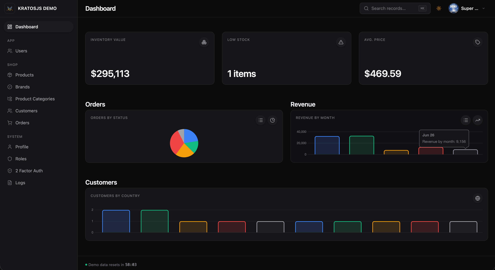
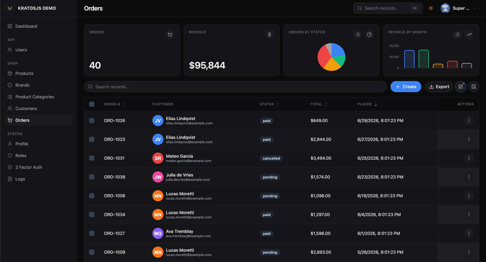

<p align="center">
  
</p>

<h1 align="center">KratosJs</h1>

<p align="center"><strong>The full-stack TypeScript framework.</strong></p>

<p align="center">
  <a href="https://kratosjs.com"></a>&nbsp;
  <a href="https://docs.kratosjs.com"></a>&nbsp;
  <a href="https://demo.kratosjs.com"></a>
</p>

Build a **server-rendered React front end** and a **dynamic admin panel** from one Node.js backend. Define resources, forms, and tables once, ship SEO-ready public pages with Inertia-style SSR, and run it all on the HTTP framework of your choice.

## What is KratosJs?

KratosJs lets you describe your data model once with a fluent TypeScript API. From that single description the framework produces:

- A fully functional **REST API** (list, create, read, update, delete, bulk actions)
- A **React admin panel** that renders forms and tables from the server-side schema — no hand-written CRUD screens
- **Server-rendered Views** — an Inertia-style, React-only SSR layer for public, SEO-ready pages (landing pages, marketing sites, CMS front-ends); route handlers return `reply.view(component, props)` and data flows from the server, not a separate API
- **Server-side validation** using the same engine the frontend uses, so rules can never be bypassed via direct API calls
- Runs on **any HTTP framework** — Express (default), Fastify, Hapi, Koa, or mounted onto an existing NestJS app

```ts
// One resource definition drives the API and the admin UI
export class UserResource extends BaseResource {
	static schema() {
		return this.make()
			.table(
				Table.make().columns([
					TextColumn.make('name').label('Name').searchable().sortable(),
					TextColumn.make('email').label('Email').searchable(),
				]),
			)
			.form(
				FormBuilder.make().schema([
					TextInput.make('name').label('Name').required(),
					TextInput.make('email').label('Email').required().email(),
					TextInput.make('password').label('Password').password().min(8),
				]),
			);
	}
}
```





## Features

| Feature                          | Description                                                                                                                                            |
| -------------------------------- | ------------------------------------------------------------------------------------------------------------------------------------------------------ |
| **Fluent TypeScript API**        | Define resources, forms, and tables with a clean, chainable API. Full autocompletion and compile-time safety.                                          |
| **React Frontend**               | The `@maxal_studio/kratosjs-react` package renders backend-defined schemas dynamically.                                                                |
| **Server-Rendered Views (SSR)**  | Inertia-style, React-only SSR for public, SEO-ready pages. First visit is server-rendered HTML; later navigations swap props as JSON — no full reload. |
| **Pluggable HTTP Framework**     | Express, Fastify, Hapi, Koa, or NestJS — pick your adapter; core is framework-neutral.                                                                 |
| **MikroORM Support**             | One adapter for MySQL, PostgreSQL, SQLite, MariaDB, and MongoDB. Swap databases without rewriting your resources.                                      |
| **Authentication & Permissions** | Built-in email auth, OAuth, and granular access control. Protect resources and actions with declarative policies.                                      |
| **Shared Validation Engine**     | Rules declared on fields run on both client and server with the same isomorphic engine — no drift, no bypass.                                          |
| **Plugin System**                | Extend with plugins that register entities, migrations, resources, pages, routes, and lifecycle hooks.                                                 |
| **Media Management**             | Integrated file uploads with local and S3 storage backends. Attach media to any resource field.                                                        |

## Quick Start

Scaffold a full app in one command:

```bash
npx @maxal_studio/kratosjs-cli new
```

The wizard asks for a project name and database driver (MySQL, PostgreSQL, SQLite, MariaDB, or MongoDB), then generates a ready-to-run app:

```bash
cd my-app
cp .env.example .env   # set your database credentials
npm run dev
```

Open the printed URL and sign in with **admin@example.com** / **password** (seeded on first boot).

## Packages

| Package                          | Description                                                                                                         |
| -------------------------------- | ------------------------------------------------------------------------------------------------------------------- |
| `@maxal_studio/kratosjs`         | Core framework — resources, form builder, table builder, validation engine, ORM adapter, auth                       |
| `@maxal_studio/kratosjs-react`   | React rendering layer — `AdminPanel`, `FormRenderer`, `TableRenderer`, all field and column components              |
| `@maxal_studio/kratosjs-express` | Express HTTP adapter (the default; installed by `kratosjs new`)                                                     |
| `@maxal_studio/kratosjs-fastify` | Fastify HTTP adapter                                                                                                |
| `@maxal_studio/kratosjs-hapi`    | Hapi HTTP adapter                                                                                                   |
| `@maxal_studio/kratosjs-koa`     | Koa HTTP adapter                                                                                                    |
| `@maxal_studio/kratosjs-nestjs`  | Mount a panel onto an existing NestJS app (Express or Fastify) — see [`examples/nestjs-app`](./examples/nestjs-app) |
| `@maxal_studio/kratosjs-cli`     | Project scaffolding CLI                                                                                             |
| `@maxal_studio/kratosjs-skill`   | AI coding-assistant skill that teaches Claude Code, Cursor, Copilot, Codex & more to build panels                   |

## Build with AI

Prefer to describe what you want instead of writing every resource by hand? Install the **KratosJs Agent Skill** into your AI coding assistant, then just ask it to generate panels — "add a `Product` resource with a relation to `Brand`, a stats widget, and an activate bulk action" — and it will follow the framework's real, current conventions (forms, tables, hooks, actions, widgets, relations, media, auth) instead of guessing.

```bash
# Installs to Claude Code (.claude/skills) and the universal .agents/skills location
npx @maxal_studio/kratosjs-skill
```

It's built on the open **[Agent Skills](https://agentskills.io)** standard, so one install works across 40+ tools — Claude Code, Cursor, VS Code / GitHub Copilot, OpenAI Codex, Gemini CLI, and more. See the [package README](./packages/kratosjs-skill/README.md) for per-tool install commands.

## Demo

A working demo is available at **[demo.kratosjs.com](https://demo.kratosjs.com)**.

## Documentation

Full documentation is available at **[docs.kratosjs.com](https://docs.kratosjs.com)**.

**Topics covered:** Getting Started · Resources · Form Fields · Table Columns · Views (SSR) · Authentication · Pages · Media · Plugin System · Creating Plugins · Custom Fields · Custom Columns

## License

ISC
